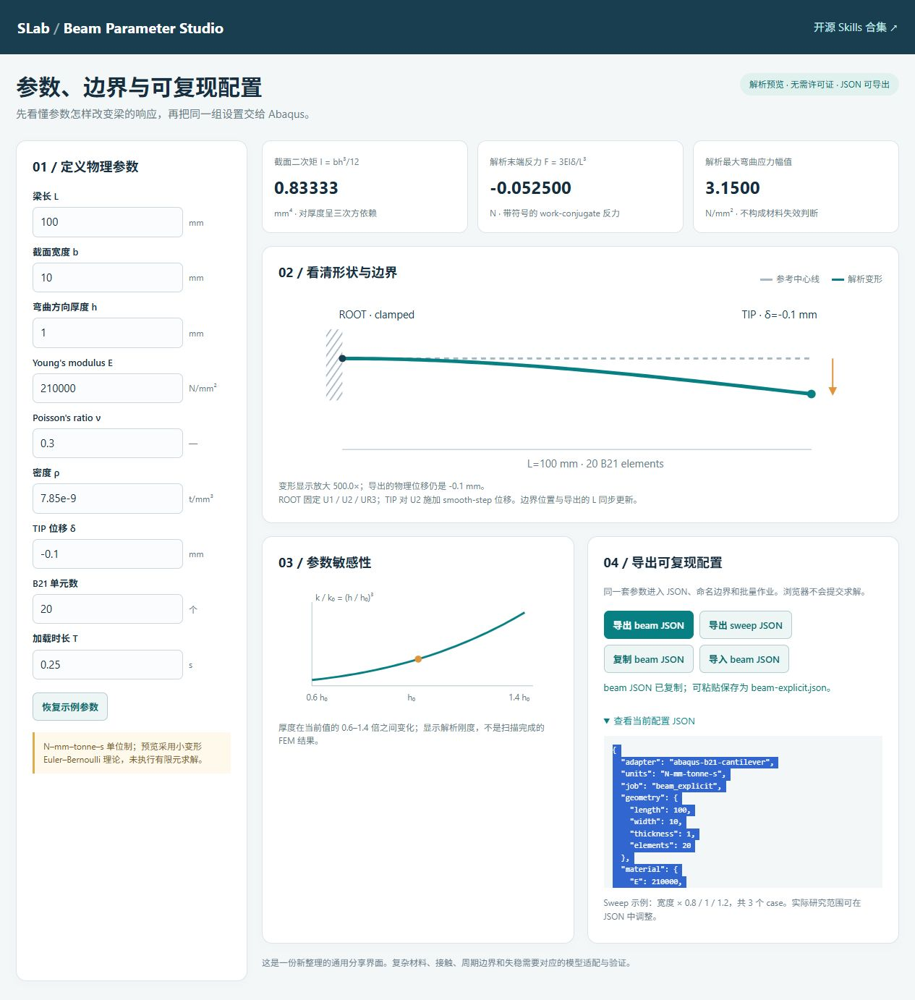
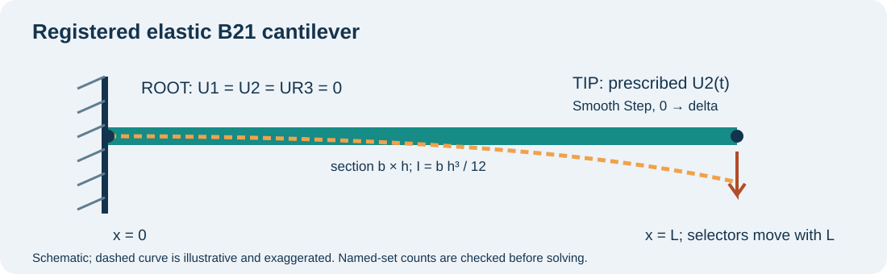
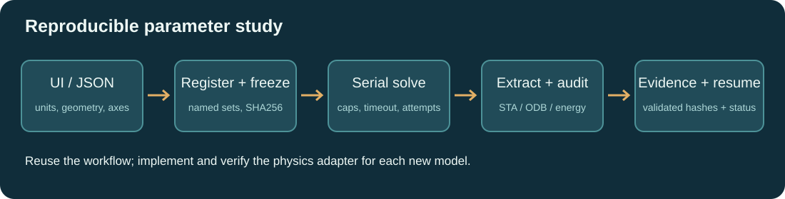

# SLAB Skills — 研究与力学工作流合集

[](https://github.com/DJDeborah/slab-skills/actions/workflows/validate.yml)
[](LICENSE)

13 个可安装的 Codex skills：研究意义、研究空白、写作、力学分析、FEM 验证、Abaqus 参数化与梁参数交互。这里把已有的研究习惯整理成可共享的目录、辅助程序、配置、示例与证据。SLAB 是本合集的名称。

**入口：** [在线 skill 目录](https://djdeborah.github.io/slab-skills/) · [梁参数界面](https://djdeborah.github.io/slab-skills/skills/beam-parameter-interface/assets/index.html) · [ZIP 发布包](https://github.com/DJDeborah/slab-skills/releases/latest) · [下载与安装](docs/INSTALL.md) · [上传与贡献](CONTRIBUTING.md) · [帮助索引](docs/HELP.md)

公开仓库允许任何人访问、下载和 Fork。贡献者通过 Fork → Pull Request 修改；维护者审核合并。直接修改主仓库需要拥有者授予写权限，公开并不等于所有访问者有直接写权限。

## 有哪些 skills？

| Skill | 解决的问题 | 运行依赖 |
|---|---|---|
| [research-significance](skills/research-significance/SKILL.md) | 研究意义：把贡献连接到科学或设计决策 | Python 标准库 |
| [research-gap](skills/research-gap/SKILL.md) | 研究空白：检索台账、能力矩阵与反例挑战 | Python 标准库；联网检索由 Codex 执行 |
| [research-writing](skills/research-writing/SKILL.md) | 论文写作：主张、证据、物理定义与 Main/SI 注册 | Python 标准库 |
| [rapid-mechanics-hypothesis](skills/rapid-mechanics-hypothesis/SKILL.md) | 快速假设验证：最小判别实验与停止规则 | Codex；按课题选择数值工具 |
| [fem-explicit-bifurcation](skills/fem-explicit-bifurcation/SKILL.md) | Explicit 验证、边界注册与分岔基准 | Python 标准库；实际求解需 Abaqus |
| [abaqus-parametric-workflow](skills/abaqus-parametric-workflow/SKILL.md) | 冻结参数扫描、串行求解、结果审计与恢复 | Python 3.10+；实际求解需 Abaqus |
| [beam-parameter-interface](skills/beam-parameter-interface/SKILL.md) | 浏览器梁参数交互、解析预览与 JSON 导出 | 现代浏览器；生成 FEM 输入需 Python |
| [helix-rod-design](skills/helix-rod-design/SKILL.md) | 螺旋杆几何、参数扫描与可制造性检查 | Python 标准库 |
| [cauchy-micropolar-modeling](skills/cauchy-micropolar-modeling/SKILL.md) | Cauchy/Micropolar 物理量、尺度与参考解 | Python 标准库 |
| [fem-cae-verification](skills/fem-cae-verification/SKILL.md) | 有限元网格、能量、收敛与证据检查 | Python 标准库；求解器按项目配置 |
| [register-analytical-fem](skills/register-analytical-fem/SKILL.md) | 解析与 FEM 的几何、单位、载荷和支撑注册 | Python 标准库 |
| [mechanics-research-handoff](skills/mechanics-research-handoff/SKILL.md) | 力学课题阶段交接、证据分级与下一步决策 | Codex |
| [research-evidence-handoff](skills/research-evidence-handoff/SKILL.md) | 主张到证据文件的可追踪交付 | Python 标准库 |

每项的实际验证范围见 [catalog.json](catalog.json) 与 [验证报告](docs/VALIDATION.md)。有些 skill 以规范和检查表为主要资源，有些还带可执行脚本；完整安装单位始终是整个 skill 目录。

## 3 分钟开始

```powershell
git clone https://github.com/DJDeborah/slab-skills.git
cd slab-skills
python tools/install.py --user --skill beam-parameter-interface --skill abaqus-parametric-workflow
```

打开新的 Codex 任务，输入：

```text
使用 $beam-parameter-interface 打开梁参数界面。预览厚度从 1 到 2 mm 的影响，
导出配置；然后使用 $abaqus-parametric-workflow 准备一个两参数扫描，
先核对边界注册、单位和 case 数量，再给出求解命令与验证标准。
```

没有 Git 也可以下载 ZIP、解压并运行同一安装命令。全量安装用 `python tools/install.py --user`。项目安装、Desktop 路径、重名处理和官方安装器详见 [安装教程](docs/INSTALL.md)。

## 可运行的 Abaqus 参数化与 beam interface



这个可分享示例把用户既有的“先注册输入、冻结扫描计划、逐案验证、保留失败证据、支持恢复”的习惯实现成独立工具。界面是本次新写的通用示例，未声称完整复原用户过去的私有 GUI。



界面显示的是 Euler–Bernoulli 小挠度解析预览。Abaqus 适配器是弹性 B21 悬臂梁，ROOT 固定 U1/U2/UR3，TIP 以 Smooth Step 控制 U2。改长度时选择器同步移动并检查节点数量。复杂接触、壳体、材料非线性、微极模型和真实 buckling 需要新适配器及独立验证。



完整操作见 [参数化教程](docs/PARAMETRIC_TUTORIAL.md)；本机实际完成了两个 Abaqus/Explicit 作业，并验证恢复时跳过已完成 case。便携自动测试 53 项通过。详情与限制见 [验证报告](docs/VALIDATION.md)。

## 从个人经验到共享 skill

可复用的优秀习惯包括：先写可证伪假设；用竞争机制和反例挑战意义与 gap；把解析和 FEM 的几何/单位/边界显式对齐；保留 Main/SI 中必要证据；以文件和数值支撑主张；小批量先验证，再扩展参数扫描。详见 [设计与来源](docs/DESIGN_AND_SOURCES.md)。

上传你的 skill 请按 [贡献教程](CONTRIBUTING.md)；从 [模板](templates/skill-template) 开始。一个 `SKILL.md` 可以成为有效 skill，可靠的工具型 skill 通常还需要脚本、输入格式、边界、失败处理和验证证据。安装结构正确与科学结论可靠需要分别检查。

## 文档

- [下载、安装、更新](docs/INSTALL.md)
- [上传、Fork、PR 与审核](CONTRIBUTING.md)
- [Skill 格式和创建模板](docs/FORMAT.md)
- [Abaqus 与界面完整教程](docs/PARAMETRIC_TUTORIAL.md)
- [Codex 验证指南](docs/CODEX_VALIDATION.md)
- [实测结果与适用边界](docs/VALIDATION.md)
- [维护、协作者、发布与 Pages](docs/MAINTAINERS.md)
- [常见问题与帮助](docs/HELP.md)
- [开源来源与许可](docs/DESIGN_AND_SOURCES.md)

Python 辅助脚本要求 3.10+；ODB 提取脚本兼容该次使用的 Abaqus 内置 Python 2.7。实际求解需用户自己的有效 Abaqus 环境。本项目不分发求解器、私有研究数据或许可配置。MIT；引用工具版本时请注明 release/tag 或 commit。
