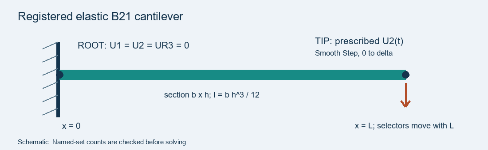
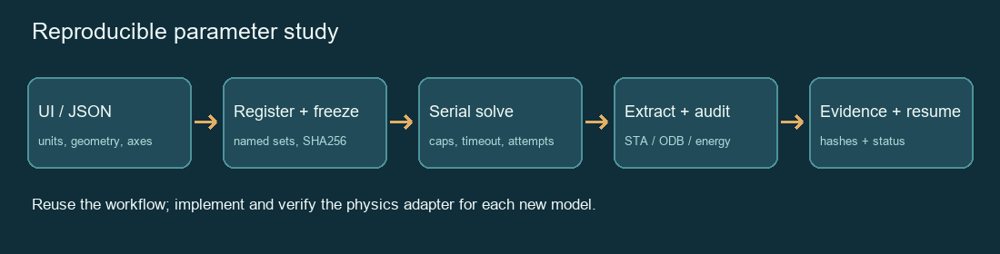

# 13. SLAB Skills: Install, Use, and Share Research Workflows

## 13.1 Background

- **What is a skill?** A folder containing `SKILL.md` instructions and optional scripts, references, templates, or interfaces. Install the complete folder so that its resources remain available. See [OpenAI: Build skills](https://learn.chatgpt.com/docs/build-skills).
- **What is SLAB Skills?** A public collection of 13 skills for research significance, research gaps, scientific writing, mechanics, FEM verification, and Abaqus automation.
- **Goal of this guide:** install a skill, run a small example, check the result, and contribute your own workflow.

**Start here:** [GitHub repository](https://github.com/DJDeborah/slab-skills) · [Skill directory](https://djdeborah.github.io/slab-skills/) · [Help](https://github.com/DJDeborah/slab-skills/blob/main/docs/HELP.md)

---

## 13.2 Prepare Your Computer

1. Open **Codex** and confirm that you can start a task in a local project folder.
2. Open **PowerShell** on Windows, or a terminal on macOS/Linux.
3. Check Python:

    ```powershell
    python --version
    ```

    **Expected:** Python **3.10 or newer**. If the command is unavailable, install Python from [python.org](https://www.python.org/downloads/) and reopen the terminal.

4. For the Git route, check Git:

    ```powershell
    git --version
    ```

    If unavailable, install it from [git-scm.com](https://git-scm.com/downloads). You can also use the ZIP route below without Git.

5. For actual FEM execution, confirm that you have a working **Abaqus installation and license**. The beam interface, input preparation, and portable checks can run without Abaqus.

**Command convention:** run the Python commands below from the downloaded `slab-skills` root folder. Enter `$skill-name` prompts in **Codex**, not in PowerShell.

---

## 13.3 Download the Collection

### A. ZIP Download — No Git Required

1. Open [SLAB Skills Releases](https://github.com/DJDeborah/slab-skills/releases).
2. Select **v0.1.0** and download **slab-skills-v0.1.0.zip** under **Assets**.
3. Extract the ZIP to a writable folder.
4. Open the extracted `slab-skills` folder. Confirm that you see `skills`, `tools`, `docs`, and `README.md`.
5. Open a terminal in that folder.

### B. Git Clone — Recommended for Contributors

1. Open a terminal in the folder where you want to keep the collection.
2. Run:

    ```powershell
    git clone https://github.com/DJDeborah/slab-skills.git
    cd slab-skills
    ```

3. Confirm that `skills/beam-parameter-interface/SKILL.md` exists.
4. To reproduce a published version, use `git checkout v0.1.0`. For contributing new work, keep or return to `main`.

---

## 13.4 Install Skills in Codex

### A. Install with a Codex Prompt

1. Start a Codex task with access to your local project.
2. Paste:

    ```text
    Use $skill-installer to install these skills from
    https://github.com/DJDeborah/slab-skills:
    - skills/beam-parameter-interface
    - skills/abaqus-parametric-workflow
    Copy each complete skill directory, including all supporting resources.
    Report the actual installation paths.
    ```

3. Wait for the installer to finish.
4. Start a fresh task and invoke `$beam-parameter-interface`.
5. If the skill is missing, restart Codex and check the reported installation path. See [OpenAI skill installation guidance](https://learn.chatgpt.com/docs/build-skills).

### B. Install with the Repository Script

1. In the downloaded repository root, install two selected skills:

    ```powershell
    python tools/install.py --user --skill beam-parameter-interface --skill abaqus-parametric-workflow
    ```

2. To install all 13 skills instead, run:

    ```powershell
    python tools/install.py --user
    ```

    **Choose either step 1 or step 2.** The installer refuses to overwrite existing directories.

3. To install only in one project, replace the example path and run:

    ```powershell
    python tools/install.py --project "D:\my-research" --skill research-gap
    ```

4. Start a fresh Codex task in that project and invoke `$research-gap`.

**Expected:** the script prints an `Installed ...` line for each selected skill. This script uses `~/.agents/skills` for user installation and `<project>/.agents/skills` for project installation. The bundled installer may use `$CODEX_HOME/skills`; use one installation route and avoid duplicate names. See [installation details](INSTALL.md).

---

## 13.5 Verify the Installation

1. In Codex, paste:

    ```text
    Use $beam-parameter-interface. Read its SKILL.md and tell me which
    interface asset it uses. Open the interface and report its initial
    length, thickness, and predicted tip reaction.
    ```

2. Confirm that Codex reads the intended skill directory and opens the beam interface.
3. In the repository terminal, run the portable checks:

    ```powershell
    python -m pip install -r requirements-dev.txt
    python tools/validate_catalog.py
    python -m unittest discover -s tests -v
    python tools/run_demo.py --out local-runs/chapter13-demo
    ```

4. Inspect `local-runs/chapter13-demo/demo-summary.json`.

**Expected for v0.1.0:** catalog validation passes, **53 tests** pass, and the demo reports `"pass": true`. Use a fresh output folder when rerunning the demo. These checks verify structure and bounded examples; real research conclusions require additional evidence.

---

## 13.6 Try the Beam Parameter Interface

1. Open the [online beam interface](https://djdeborah.github.io/slab-skills/skills/beam-parameter-interface/assets/index.html). Alternatively, open `skills/beam-parameter-interface/assets/index.html` locally.
2. Click **Reset example parameters** (`恢复示例参数`).
3. Confirm the defaults:

    | Parameter | Value |
    |---|---:|
    | Length L | 100 mm |
    | Width b | 10 mm |
    | Thickness h | 1 mm |
    | Young's modulus E | 210,000 N/mm² |
    | Prescribed tip displacement | −0.1 mm |
    | Predicted tip reaction | −0.0525 N |

4. Change **Thickness h** (`弯曲方向厚度 h`) from **1** to **2 mm**.
5. Confirm that the predicted reaction becomes **−0.42 N**, eight times the original magnitude. The preview follows `I = b h³/12` and `F = 3EIδ/L³`.
6. Set **Length L** to **0**. Confirm that the interface shows an invalid-parameter message.
7. Click **Reset example parameters** again.
8. Click **Export beam JSON** (`导出 beam JSON`) and save `beam-explicit.json` in the repository root.
9. If download is blocked, click **Copy beam JSON** (`复制 beam JSON`), paste into a plain-text editor, and save the same filename as UTF-8. If copying is blocked, expand the JSON panel and copy its text manually.
10. Generate an Abaqus input file:

    ```powershell
    python skills/abaqus-parametric-workflow/scripts/prepare_explicit.py beam-explicit.json --out local-runs/chapter13-beam
    ```

11. Open `local-runs/chapter13-beam/registration.json`. Check that **ROOT** and **TIP** each select one node, ROOT constrains DOFs **1/2/6**, and TIP controls DOF **2**.

**Expected:** the output folder contains `beam_explicit.inp` and `registration.json`. The interface shows an analytical preview; generating an INP has not yet run FEM.




---

## 13.7 Run an Abaqus Parameter Sweep

### A. Prepare Two Cases

1. Use the bundled sweep, which varies beam width between **8 and 10 mm**:

    ```powershell
    python skills/abaqus-parametric-workflow/scripts/prepare_sweep.py skills/abaqus-parametric-workflow/assets/sweep.json --out local-runs/chapter13-sweep --max-cases 2
    ```

2. Open `local-runs/chapter13-sweep/manifest.json` and check the two case entries.
3. Inspect each case's `config.json`, INP, and `registration.json`.
4. Preview the execution plan:

    ```powershell
    python skills/abaqus-parametric-workflow/scripts/run_sweep.py local-runs/chapter13-sweep/manifest.json
    ```

**Expected:** two planned cases and `"solver_launched": false`. The output directory must be new; do not edit a frozen case to change its parameters.

### B. Execute and Check Results

1. Confirm that `abaqus` works in your terminal. If it is not on PATH, find your actual `abaqus.bat` launcher.
2. Run the two cases:

    ```powershell
    python skills/abaqus-parametric-workflow/scripts/run_sweep.py local-runs/chapter13-sweep/manifest.json --execute --abaqus abaqus --max-jobs 2
    ```

    On Windows, replace `--abaqus abaqus` with `--abaqus "C:\YOUR_SIMULIA\Commands\abaqus.bat"` when necessary.

3. Wait for both cases to finish. The runner submits them serially.
4. Open `local-runs/chapter13-sweep/summary.csv`.
5. Confirm `state=completed` and `quality_pass=True` for both cases.
6. Inspect each case's `attempts/001/quality.json`. Check reaction error, kinetic/internal energy ratio, and artificial/internal energy ratio.

**Reference values measured with the published example:**

| Width | Final RF2 | Analytical RF2 | Reaction error |
|---|---:|---:|---:|
| 8 mm | −0.04202165 N | −0.042 N | 0.05156% |
| 10 mm | −0.05252707 N | −0.0525 N | 0.05156% |

These are elastic B21 cantilever checks. For a new geometry, material, contact model, or buckling problem, implement and verify the corresponding adapter before extending the sweep. See [measured validation](VALIDATION.md).

### C. Resume or Retry

1. Run the same plan with `--resume`:

    ```powershell
    python skills/abaqus-parametric-workflow/scripts/run_sweep.py local-runs/chapter13-sweep/manifest.json --execute --abaqus abaqus --max-jobs 2 --resume
    ```

2. Confirm `launched=0` and `skipped_completed=2` after two successful runs. Keep the same launcher option used above.
3. If a case failed, fix the environment and add `--retry-failed` to the resume command. The runner preserves previous attempts.
4. To change parameters, edit a copy of the sweep JSON and prepare a **new output directory**.



---

## 13.8 Use Skills for Research Significance, Gaps, and Writing

1. Install the three research skills if they are not already installed:

    ```powershell
    python tools/install.py --user --skill research-significance --skill research-gap --skill research-writing
    ```

2. Open a Codex task in your research project. Provide your question, available evidence, and relevant papers.
3. Start with significance:

    ```text
    Use $research-significance for this research question: [insert question].
    Give three candidate contributions. For each, state the scientific or
    design decision it changes, supporting evidence, a rival explanation,
    and the cheapest discriminating test. Mark unsupported points explicitly.
    ```

4. Test the gap:

    ```text
    Use $research-gap to test this candidate gap: [insert bounded claim].
    Keep a search ledger with queries, dates, and primary sources.
    Build a paper-capability matrix and search for counterexamples.
    Distinguish not searched, not reported, and explicitly ruled out.
    Save the ledger and a bounded, falsifiable gap statement.
    ```

5. Draft from evidence:

    ```text
    Use $research-writing to revise my introduction and results section.
    Preserve physical definitions and essential Main/SI evidence.
    Produce a claim-to-evidence map. Do not add experiments or conclusions
    that the supplied material does not support.
    ```

6. Open the cited primary papers and check the passages supporting each claim.
7. Keep the search ledger, evidence map, revised draft, and unresolved questions in your project folder.

**Expected:** inspectable artifacts and bounded claims. A fluent paragraph alone does not establish a research gap or a physical mechanism.

---

## 13.9 Create Your Own Skill

1. Choose one repeatable task, such as **register shell boundary regions** or **export force–displacement histories**.
2. Return to the `slab-skills` root folder.
3. Copy the template on Windows:

    ```powershell
    Copy-Item -LiteralPath "templates/skill-template" -Destination "skills/my-skill-name" -Recurse
    ```

    On macOS/Linux: `cp -R templates/skill-template skills/my-skill-name`.

4. Edit `skills/my-skill-name/SKILL.md`:

    ```yaml
    ---
    name: my-skill-name
    description: Register named boundary regions and verify selected entities before FEM execution.
    ---
    ```

5. Replace the template body with **required inputs → actions → outputs → acceptance criteria → failure handling**.
6. Edit `agents/openai.yaml`. Include `$my-skill-name` in `default_prompt`.
7. Add scripts only where useful. Put a small anonymous example in `assets/` and method notes in `references/`.
8. Add an entry to the `skills` array in `catalog.json`:

    ```json
    {
     "name": "my-skill-name",
     "category": "simulation",
     "summary_zh": "命名边界注册与实体选择检查",
     "license": "MIT",
     "runtime": "Python 3.10+; solver-specific adapter",
     "verification": "State the checks actually completed and remaining limits.",
     "source": "Your name and any upstream source/license"
    }
    ```

    The directory's current `summary_zh` field is Chinese; the rest of your skill can be English. Use MIT only when you own the contribution or have compatible sharing rights.

9. Validate and install into a fresh test destination:

    ```powershell
    python tools/validate_catalog.py
    python tools/install.py --dest ../slab-skill-test --skill my-skill-name
    ```

10. Run one representative task in Codex. Record its inputs, outputs, acceptance result, and limitations. A boundary adapter should check expected node/face counts before solving.

---

## 13.10 Upload a Skill to GitHub

### A. Fork and Pull Request — Recommended

1. Sign in to GitHub and open [DJDeborah/slab-skills](https://github.com/DJDeborah/slab-skills).
2. Click **Fork → Create fork**.
3. Clone your fork; replace `YOUR_NAME` with your GitHub username:

    ```powershell
    git clone https://github.com/YOUR_NAME/slab-skills.git slab-skills-contribution
    cd slab-skills-contribution
    git switch -c add/my-skill-name
    ```

4. Copy your complete skill directory into `skills/` and update `catalog.json` in this fork.
5. Run:

    ```powershell
    python -m pip install -r requirements-dev.txt
    python tools/validate_catalog.py
    python -m unittest discover -s tests -v
    ```

6. Commit the contribution:

    ```powershell
    git add skills/my-skill-name catalog.json
    git commit -m "Add my-skill-name with example and verification"
    git push -u origin add/my-skill-name
    ```

7. Open your fork on GitHub and click **Compare & pull request**.
8. Set **base** to `DJDeborah/slab-skills:main` and **compare** to your fork's `add/my-skill-name` branch.
9. Describe the task, dependencies, source/license, example, completed checks, and limits. Click **Create pull request**.
10. Respond to review comments with commits on the same branch. The PR updates automatically.

### B. Browser Upload — No Git Required

1. Fork the repository and create a branch in your fork.
2. Open `skills` and select **Add file → Upload files**.
3. Upload the complete skill folder. Check that its directory structure is preserved.
4. Update `catalog.json`, commit, and open a PR to the original repository.
5. If folder paths are not preserved, use the Git route above.

**Expected:** your PR appears in the original repository and runs its automatic checks. A public repository accepts Fork/PR contributions; direct edits to the original require collaborator access. See the [contribution tutorial](../CONTRIBUTING.md).

---

## 13.11 Update or Replace an Installed Skill

1. In your downloaded repository, check for local changes:

    ```powershell
    git status
    ```

2. Save or commit your changes before updating. On `main`, run:

    ```powershell
    git pull --ff-only
    ```

3. Install the new version into a **fresh test directory** first:

    ```powershell
    python tools/install.py --dest ../slab-update-check --skill beam-parameter-interface
    ```

4. Check the new version using a small example.
5. Move the old installed skill directory to a backup location **outside all skill search paths**.
6. Install the replacement with your original installation route.
7. Start a fresh Codex task and check the actual loaded path.

**Expected:** the replacement installs without `Refusing to overwrite`. For reproducible research, record the release tag or commit used for each run.

---

## 13.12 Command Cheat Sheet

| Task | Command or action |
|---|---|
| Download source | `git clone https://github.com/DJDeborah/slab-skills.git` |
| Install all skills | `python tools/install.py --user` |
| Install one skill | `python tools/install.py --user --skill research-gap` |
| Validate directories and catalog | `python tools/validate_catalog.py` |
| Run portable tests | `python -m unittest discover -s tests -v` |
| Run research demo | `python tools/run_demo.py --out local-runs/new-demo` |
| Open beam interface | [Beam Parameter Studio](https://djdeborah.github.io/slab-skills/skills/beam-parameter-interface/assets/index.html) |
| Invoke a skill | Enter `$skill-name` in Codex |
| Start a contribution | Fork → new branch → edit → PR |

---

## 13.13 Troubleshooting

| Problem | Steps to try |
|---|---|
| Codex cannot find the skill | Check the printed installation path and `SKILL.md`; remove duplicate installations; restart Codex. |
| `Refusing to overwrite` | Test the new version separately; back up the old skill outside search paths; install again. |
| `No module named yaml` | Run `python -m pip install -r requirements-dev.txt` with the same Python used for validation. |
| JSON download or copy fails | Expand the configuration panel, copy the visible JSON, and save it as UTF-8 plain text. |
| The sweep does not run Abaqus | The default is preview only. Add `--execute`, check the launcher, and confirm your license works. |
| `Frozen hash changed` | Preserve the old run; prepare the updated configuration in a new output directory. |
| A failed case is not retried | Fix the environment, then use both `--resume` and `--retry-failed`. |
| A command fails on a path with spaces | Quote the path and run commands from the repository root. |
| FEM differs from the reference | Check units, registration, output definitions, time/mesh sensitivity, and energy history before changing tolerances. |

**Validation note:** v0.1.0 includes 53 passing portable tests, four passing Windows/Linux CI jobs, and two completed licensed Explicit beam cases. UI parameter changes, JSON copying, and input preparation were checked; automated download-file capture and browser file import were not verified. See the [validation report](VALIDATION.md).

---

## References

1. [SLAB Skills repository](https://github.com/DJDeborah/slab-skills).
2. [SLAB Skills installation guide](INSTALL.md).
3. [SLAB Skills contribution guide](../CONTRIBUTING.md).
4. [SLAB Skills measured validation report](VALIDATION.md).
5. [OpenAI: Build skills](https://learn.chatgpt.com/docs/build-skills).
6. [GitHub: Contributing to a project](https://docs.github.com/en/get-started/exploring-projects-on-github/contributing-to-a-project).
