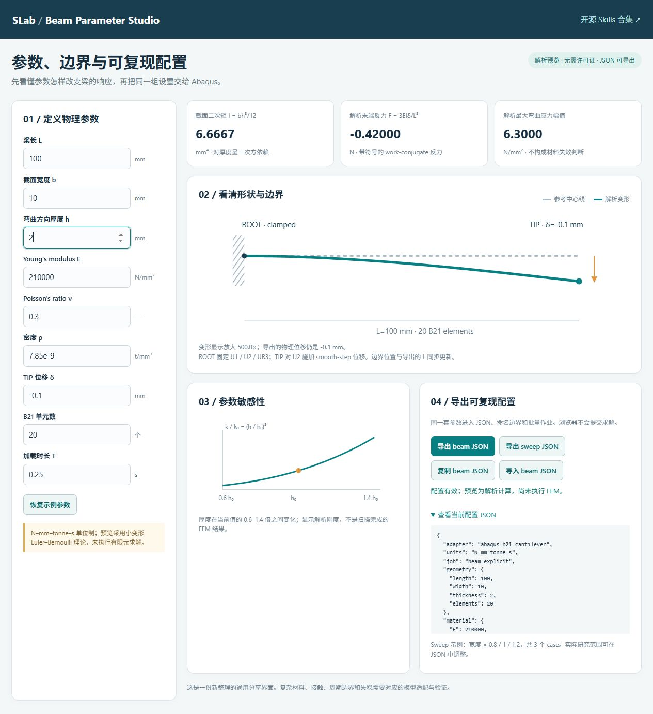

# Abaqus 参数化与梁参数界面：从预览到实测

## 1. 界面

直接打开 [在线梁界面](https://djdeborah.github.io/slab-skills/skills/beam-parameter-interface/assets/index.html)，或双击 `skills/beam-parameter-interface/assets/index.html`。

输入 L、b、h、E、ν、密度、末端位移、单元数和加载时长。界面立即更新形状、边界位置、反力与厚度敏感性。默认单位 N–mm–tonne–s，密度 `7.85e-9 tonne/mm³`；输入 mm 与 N/mm²。




小挠度预览用 `I=b*h³/12`，`F=3*E*I*δ/L³`。其他参数固定时厚度从 1 变 2，反力绝对值从 0.0525 N 变 0.42 N。图中形变使用显示放大系数，不作为 FEM 求解结果。

点击导出 beam JSON；若浏览器不支持下载，使用 **复制 beam JSON**，粘贴到纯文本文件 `beam-explicit.json`。配置区也可手动展开复制。两条导出路径共用当前界面配置。导入 JSON 会检查模型/单位/边界并恢复界面参数；质量阈值回到示例默认值，应重新审阅。

## 2. 单个 beam 配置生成输入

在仓库根目录：

```powershell
python skills/abaqus-parametric-workflow/scripts/prepare_explicit.py beam-explicit.json --out local-runs/my-beam
```

输出 INP 与 registration.json。逐项核对 ROOT/TIP、节点计数、自由度、单位、材料、方向与载荷。当前适配器只支持直线弹性 B21 悬臂梁。

## 3. 参数扫描准备与预览

界面导出 sweep JSON 会生成 b 的 0.8/1/1.2 倍扫描。仓库自带两案 width=8/10 的 `assets/sweep.json`，可直接运行：

```powershell
python skills/abaqus-parametric-workflow/scripts/prepare_sweep.py skills/abaqus-parametric-workflow/assets/sweep.json --out local-runs/my-sweep --max-cases 2
python skills/abaqus-parametric-workflow/scripts/run_sweep.py local-runs/my-sweep/manifest.json
```

第二条默认仅预览；终端列出计划和总数，不启动求解器。每个 case 用参数内容生成稳定 ID；manifest 冻结输入、边界注册和工具哈希。输出目录必须全新。支持参数列表：length/width/thickness/elements、E/nu/density、duration、tip_displacement；详细键名见 [workflow](../skills/abaqus-parametric-workflow/references/workflow.md)。多个 axis 是笛卡尔积，总数不得超过 --max-cases（默认 16）。

## 4. 执行 Abaqus

先在终端确认自己的 Abaqus 环境有效。把示例路径替换为真实启动器，Windows 通常是 abaqus.bat；PATH 已配置可用 `--abaqus abaqus`：

```powershell
python skills/abaqus-parametric-workflow/scripts/run_sweep.py local-runs/my-sweep/manifest.json --execute --abaqus "C:\YOUR_SIMULIA\Commands\abaqus.bat" --max-jobs 2
```

串行执行，--max-jobs 限制这次允许启动的数量；默认超时 600 秒可用 --timeout 调整。核对 .sta 完成、ODB 可读、所需输出存在后提取 history，并检查 KE/IE、AE/IE 和解析反力误差。状态写入 case 的 status.json，整体写入 summary.csv。失败停止并保留 attempt。

## 5. 恢复与重试

```powershell
python skills/abaqus-parametric-workflow/scripts/run_sweep.py local-runs/my-sweep/manifest.json --execute --abaqus abaqus --max-jobs 2 --resume
```

已完成 case 必须通过冻结文件及证据哈希校验才会跳过。失败/中断的 case 需要额外显式 `--retry-failed`；新 attempt 独立保留旧失败。修改了参数、工具或输入时重新建输出目录，不使用旧 manifest 假装同一研究计划。

## 6. 如何扩展到真正的课题

流程的冻结、队列、审计和恢复可以复用；几何、接触、材料、边界映射、求解步骤和验证判据必须按课题重新注册。先写 adapter 的输入 schema 与命名集规则，做一个低成本基准，明确期待响应，再扩大扫描。

Explicit 能量比低只支持当前准静态检查。要证明平衡分岔/临界点，还需要适合问题的平衡路径、扰动/特征值或其他独立稳定性证据；不要把动态跳跃直接叫作分岔。与 `$register-analytical-fem`、`$fem-cae-verification`、`$fem-explicit-bifurcation` 配合使用。
